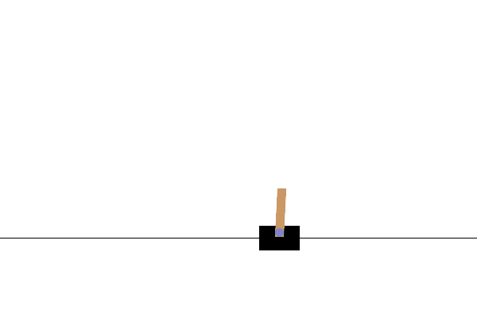

# Cartpole Balancing with Deep Reinforcement Learning

## Introduction

The cartpole problem is a classical deep reinforcement learning problem (DRL). It is an inverted pendulum with a center of gravity above its pivot point.
Although the system is unstable, it can be balanced by a movable frinctionless cart by moving its pivot point under the center of mass of the system.
The goal is to train a software which balances the pole using this technique for as long possible.

## Description
A more detailed description of the cartpole problem can be found in the [Gym Documentation](https://www.gymlibrary.dev/environments/classic_control/cart_pole/).
Our implementation differs slightly from this implementation as we allow for a continuous action space instead of a discrete one. This means, instead of allowing the cart to be moved only to the left or right with a constant force, we allow the cart to be moved with a force value between $a \in [-1, 1]$, where the boundaries corresponds to a left and right move of the original problem respectively. Values in between represent left moves (for a<0) or right moves (a>0) with force magnitudes $10\cdot|a|$ respectively. Note that the problem formulation with a discrete action space is impossible to solve with TD3 and therefore we chose the continuous representation (see below).
The state space consists of a 4-tuple containing the position and velocity of cart as well as pole angle and its velocity respectively. We denote those values as $(x, \dot{x}, \theta, \dot{\theta})$.
We furthermore define bounds for the position and pole angle and stop the simulation as soon as those bounds are violated.

The reward function penalizes the agent proportional to the cart distance from the center as well as angle distance from the angular threshold $\theta_t$. If the cart leaves the allowed bounds, we add an additional penalty of 20. More specifically, we use the following cost function:
$\mathrm{cost}(x, r, d) = (\mathrm{sgn}(r) \cdot 100 \cdot r^2 - 4\cdot x^2) / 1000 - 20\cdot d$, where $r = (\theta_t/4 - |\theta|) / (\theta_t/4)$ and $d=1$ if the system goes out of bounds and $d=0$ otherwise.

The cartpole problem can traditionally be efficiently solved with on-policy methods such as actor-critic (e.g. [A2C](https://stable-baselines3.readthedocs.io/en/master/modules/a2c.html)). In our approach, we are using the off-policy method TD3 (cf  the [stable baselines documentation](https://stable-baselines3.readthedocs.io/en/master/modules/td3.html) for details).

## Directory Structure

The cartpole environment is implemented in C++ in file `env.cpp` and a corresponding pybind11 wrapper is defined in `py_env.cpp`. With this wrapper, the environment can also be used from python based training infrastructures but we only use it for visualization.
Since the problem is very small, we will run the environment on the CPU and use the GPU only for training and inference. The training code is implemented in `train.cpp`. Before training can be started, the models have to be initialized from pytorch. This can be done by executing `python/initialize_models.py` from this directory.

The configuration file for the sim environment is `config_sim.yaml` and the one for the TD3 deep reinforcement learning system is in `config.yaml`.

After training the trained agent can be visualied using the visualization code in `python/visualize.py`.

## Installation

We highly recommend building the example together with the torchfort library using `cmake`. The example can also be build independently but the cmake specification file `CMakeList.txt` might need to be adjusted.

## How To Run

In order to run training, create a directory called `checkpoint` in the location of the `train_cart_pole` and place the `python` directory as well as both configs file there. Execute `python python/initialize_models.py` which should create the two model files `policy.pt` and `value.pt` respectively. Those are PyTorch compatible model files which can be read by torchfort.
Once everything is in place, the training can then be started by executing `train_cart_pole`. This file will read the two configuration files for the simulation (`config_sim.yaml`) and the TD3 DRL system (`config.yaml`).

The training is logging action and state data as well as loss and reward values during the training process. Training will automatically successfully end once an evaluation episode was able to balance the pole for at least 500 environment steps without falling down. Otherwise it will terminate unsuccessfully after 50000 episodes (note that this number can be changed in the `config_sim.yaml` file).

During or after training, the cart performance can be visualized using the `python/visualize.py` script. It uses [pygame](https://www.pygame.org) to render frames and [MoviePy](https://moviepy.readthedocs.io/en/latest/) to write the rendered file as a gif as well as an mp4 video. The script can be run via
`python python/visualize.py --policy_checkpoint=<path to policy checkpoint> --num_steps=<number of steps/frames to run> --output_path=<directory where the gif and videos will be stored>`. Note that in TD3, the target policy model which should be used can be found under `checkpoints/policy_target/model.pt`. The policy model under `checkpoints/policy/model.pt` is the active network and might not perform as well as expected. For a detailed explanation of the difference, see the [TD3 documentation](https://stable-baselines3.readthedocs.io/en/master/modules/td3.html).
