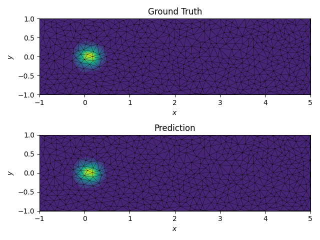

# MeshGraphNet Online Training Example

## Problem Description
In this example, we demostrate how to use TorchFort to perform online training of a model with a numerical simulation on an unstructured mesh. Specifically,
we train a [MeshGraphNet](https://arxiv.org/abs/2010.03409)-like model to predict the simulation field at $t + \Delta t$ from a provided input field at $t$. 

For our simulation, we consider the linear advection equation in 2D in a rectangular box,

$$
\begin{matrix}
\frac{du(x,y,t)}{dt} + \nabla \cdot (\mathbf{a} u(x,y,t)) = 0 \\
u(x,y,0) = \exp(-20x^2) \\; \exp(-20y^2) \\
\mathbf{a} = \lbrace a_x, a_y \rbrace = \lbrace 1, 0 \rbrace \\
x \in [-1, 5], \\; y \in [-1, 1], \\; t \in [0, 5]
\end{matrix}
$$

which has an analytical solution of the form,

$$u(x,y,t) = \exp(-20 (x - a_x t)^2) \\; \exp(-20 (y-a_y t)^2)$$

We aim to train a model to learn the mapping from the solution field at time $t$, $u(x,y,t)$, to the solution field at future time, $t + \Delta t$:

$$\sigma(u(x,y,t)) = u(x,y,t + \Delta t))$$

where $\sigma$ is the function that represents the model.

For this example, we use the analytical solution as a stand-in for a real numerical solver, sequentially generating $u(x,y,t)$ samples
at $\Delta t = 0.1$ intervals in time over the course of training, restarting the sequence when $t=5.0$. We compute corresponding analytical future solution fields, $u(x,y,t + \Delta t)$,
to use as training labels.

This example demostrates the usage of the multi-argument training and inference routines available in TorchFort and how to implement and use a custom loss function.


## General Details
The example code is split one Fortran source file and two PyTorch scripts to generate the model and loss function modules.

[`train.f90`](train.f90) contains the main program and training/inference loops. The simulation is run on an unstructured mesh, defined by the [`nodes.txt`](nodes.txt) and [`connectivity.txt`](connectivity.txt) files.
The first two columns of the `nodes.txt` file contain the $x$ and $y$ coordinates of the mesh nodes respectively, and the last column contains a node type value, indicating whether the node is on a boundary (`0`) 
or in the interior (`1`). The `connectivity.txt` file contains a list of triplets which are indices corresponding to nodes from `nodes.txt`. Those triplets define the triangles within the unstructured mesh.

[`generate_model.py`](generate_model.py) contains a PyTorch script to define a MeshGraphNet-like model. Unlike the `simulation` example, this model take multiple input arguments (`edge_idx`, `edge_feats`, and `node_feats`)
which requires the use of the `torchfort_train_multiarg` and `torchfort_inference_multiarg` functions to operate. The `edge_idx` input is a list of of node index pairs, where the first column corresponds to the sending and the second column to the receiving nodes in the message passing process. Since the mesh in our problem is bi-directional, we make sure that the reverse connections are added to the supplied list. The `edge_feats` input
contains the edge features of the model, which are the difference in the x-coordinates of the edge nodes, difference in the y-coordinates of the edge nodes, and the edge length. The `node_feats` input is a list of the node features of the model,
which in this case are the values of $u(x,y,t)$ at the mesh nodes.

[`generate_loss.py`](generate_loss.py) contains a PyTorch script to define a custom loss function typical of a MeshGraphNet training. In particular, this loss function computes an MSE loss over the mesh nodes, excluding nodes along the
mesh boundaries, which are often fixed user-prescribed values (e.g., a constant inflow boundary condition). The built-in loss functions within TorchFort do not provide the flexibility to accomplish this, so instead, we use a custom
loss function defined in PyTorch and exported with TorchScript. Similar to the model, this loss function takes multiple input arguments (`prediction`, `label` and `node_types`) which reqiures the use of the `torchfort_train_multiarg` function.
While the `prediction` and `label` arguments are already provided automatically in the training backend, the additional `node_types` tensor must be provided using the `extra_loss_args` argument of `torchfort_train_multiarg`. We select this custom loss function by defining the following block in the configuration file [`config.yaml`](config.yaml):
```
loss:
  type: torchscript
  parameters:
    filename: "loss_torchscript.pt"
```

Refer to [`config.yaml`](config.yaml) for additional details of the TorchFort configuration for this problem.

## Training and rollout validation
To run this case, use the following commands:
```
$ python generate_loss.py
$ python generate_model.py
$ ./train
```

The training will proceed for 100,000 steps, printing information on the loss every 100 iterations. This is followed by rollout validation testing of the trained
model for 50 steps, starting with the ground truth solution at $t = 0.0$, $u(x,y,0.0)$ as the initial input to predict $u(x,y,\Delta t)$. This is followed by predictions
of future timesteps  by using previous predictions as input in a recurrent fashion. The ground truth solution fields and rollout prediction are written to text files for
each of the 50 steps.

To visualize the rollout results of the trained model, we've provided a [`visualize.py`](visualize.py) Python script to load the validation output samples and produce
a short video of the results. An example command to run this script is:
```
$ python visualize.py --input_path <path to directory containing results text files> --output_path <path to directory to write output video>
```

The resulting video for the trained MLP should look like this:



This video shows the ground truth solution field $u(x,y,t)$ in the top figure and the rollout predicted solution field in the bottom figure.
