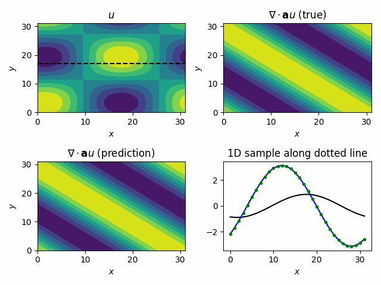

# Online Training Example

## Problem Description
In this example, we demostrate how to use TorchFort to perform online training with a numerical simulation. Specifically,
we train two simple models to approximate the divergence of a vector field using data sampled from a running
numerical simulation.

For our simulation, we consider the linear advection equation in 2D in a periodic box,

$$
\begin{matrix}
\frac{du(x,y,t)}{dt} + \nabla \cdot (\mathbf{a} u(x,y,t)) = 0 \\
u(x,y,0) = \sin(\pi x) \\; \sin(\pi y) \\
\mathbf{a} = \lbrace a_x, a_y \rbrace \\
x \in [-1, 1], \\; y \in [-1, 1], \\; t \in [0, T]
\end{matrix}
$$

which has an analytical solution of the form,

$$u(x,y,t) = \sin(\pi (x - a_x t)) \\; \sin(\pi (y-a_y t))$$

We aim to train a model to learn the mapping from the solution field, $u(x,y,t)$, to the divergence, $\nabla \cdot (\mathbf{a} u(x,y,t))$:

$$\sigma(u(x,y,t)) = \nabla \cdot (\mathbf{a} u(x,y,t))$$

where $\sigma$ is the function that represents the model.

For this example, we use the analytical solution as a stand-in for a real numerical solver, sequentially generating $u(x,y,t)$ samples
at $\Delta t = 0.01$ intervals in time over the course of training. We compute corresponding analytical divergence fields, $\nabla \cdot (\mathbf{a} u(x,y,t))$,
to use as training labels. This is by no means a rigorous training task, but provides us an opportunity to illustrate how to integrate
TorchFort in a typical numerical simulation loop. 

## General Details
The example code is split into two main source files.

[`simulation.f90`](simulation.f90) defines a Fortran module to control the simulation. It has an initialization suboutine and a subroutine to advance the solution in time,
returning both the scalar solution field, `u`, and corresponding divergence field, `u_div`. 

[`train.f90`](train.f90) contains the main program and training/inference loops. The simulation is run on a small numerical grid of $32^2$ points in single precision.
For training, we run 100,000 training steps with a minibatch size of 16. In other words, we advance and collect training samples from the simulation 16 times per training step.
After training is complete, we run a validation loop over 1,000 additional samples with a minibatch size of 1. At the end of the program, a training checkpoint and trained
model are saved using TorchFort utilities. For completeness, the program also enables loading TorchFort checkpoints; however, this is mostly for demostrative purposes as 
this example should run fast and not require checkpoint/restart to complete. Run `./train -h` for a full listing of command line options available.

The Fortran program is GPU-accelerated using OpenACC, a common directive-based programming approach in HPC. This example also demonstates OpenACC
compatibility with TorchFort.

## Training a simple MLP using the built-in MLP model
First, we will run the training using the built-in MLP model available in TorchFort using the provided [`config_mlp_native.yaml`](config_mlp_native.yaml) file.
TorchFort contains a configurable MLP model (defined in [`mlp_model.cpp`](/src/csrc/models/mlp_model.cpp)) that can be used directly by users who
only require these simple networks. We select this model by defining the following block in the configuration file:
```
model:
  type: mlp
  parameters:
    dropout: 0.0
    layer_sizes: [1024, 1024]
```
This block specifies the built-in MLP model type with dropout disabled and a single linear layer with an input size of 1024 and output size of 1024. Given our
numerical grid size of $32^3$, this is training a single linear layer to map the flattened discretized solution array of 1024 elements to a flattened array
of corresponding discrete divergence values.

The remaining blocks in the configuration file control other aspects of the training, such as the loss, optimizer, and learning rate schedule. See
the documentation section on configuration file creation for more information.

To run this case, use the following command:
```
$ ./train --configfile config_mlp_native.yaml
```

The training will proceed for 100,000 steps, printing information on the loss every 100 iterations. This is followed by validation testing of the trained
model for 1,000 steps, with model input, target output (label), and predicted output fields writted to HDF5 files every 10 steps.

To visualize the output of the trained model, we've provided a `visualize.py` Python script to load the validation output samples and produce
a short video of the results. An example command to run this script is:
```
$ python visualize.py --input_path <path to directory containing validation HDF files> --output_path <path to directory to write output video>
```

The resulting video for the trained MLP should look like this:



This video shows the input solution field $u(x,y,t)$ in the top left, the target analytical divergence field $\nabla \cdot (\mathbf{a} u(x,y,t))$ in the top
right, the predicted divergence field in the lower left. The lower right depicts a 1D sample taken at the location depected by the horizontal dotted line
in the input solution field plot, where the black solid line is the solution, the blue solid line is the target divergence, and the green dots are the
predicted divegence values from the model.

## Training a simple fully convolutional network (FCN) using an exported PyTorch model
In the first case, we used the built-in MLP model available in TorchFort. For greater customization/flexibility, TorchFort also allows users to define
models in PyTorch, export them in TorchScript using PyTorch JIT, and load the saved models in TorchFort for training and inference. To illustrate this,
we've provided the [`config_fcn_torchscript.yaml`](config_fcn_torchscript.yaml) and corresponding [`generate_fcn_model.py`](generate_fcn_model.py) script.

The `generate_fcn_model.py` script shows how to define a model in PyTorch, generate a TorchScript model using `torch.jit.script` and saving the model to
disk. In this case, we've defined a model that is just a single 2D convolutional layer with a kernel width of 3 and circular padding, which can be trained to approximate a localized stencil-based computation of the divergence. Running this script will create a `fcn_torchscript.pt` file, which contains the
TorchScript exported model that can be used with TorchFort.

To use this model in TorchFort, the model block in the configuration file is changed to:
```
model:
  type: torchscript
  torchscript_file: fcn_torchscript.pt
```
which tells TorchFort to use a TorchScript model which TorchScript model file to load.

To run this case, use the following commands
```
$ python generate_fcn_model.py
$ ./train --configfile config_fcn_torchscript.yaml
```

The training/validation will run similarly to the case using the built-in MLP model, with the loss converging at a quicker rate using this FCN model.

A main takeaway from this case is the flexibility enabled using exported TorchScript models. It is simple to replace the FCN model we've defined with
any number of different model architectures you can define and export from PyTorch without requiring any modification to the compiled simulation program.

## Multi-GPU Training
TorchFort supports basic data-parallel training of models which we demonstrate in this last case. 

[`train_distributed.f90`](train_distributed.f90) contains the main program, modified to run on two GPUs. Each GPU generates simulation data for only half of the computational grid at
a given timestep, emulating a typical numerical code using a _slab_ data decomposition; however, the models require the data for the full computation grid for training.
For each training step, the program runs and gathers 16 training samples from the simulation for the minibatch, with each GPU only producing data
for half of the computational domain. `MPI_Alltoallv` is used to redistribute the sample data so that ultimately each GPU contains 8 training samples over the complete
computational grid. Each GPU provides these 8 samples to the TorchFort training routines, which are processed in data-parallel (with a global batch size
of 16). Since the global batch size in this multi-GPU case is equivalent to the batch size used for the single GPU cases, we should expect similar training
convergence. Validation is run on a single GPU using complete simulation samples collected using `MPI_Allgather`. 

To run this case, use the following command:
```
mpirun -np 2 ./train_distributed --configfile config_mlp_native.yaml
```

You should find that the 2 GPU training converges similarly to the single GPU case, with final validation results of the trained model at equivalent error
levels.
